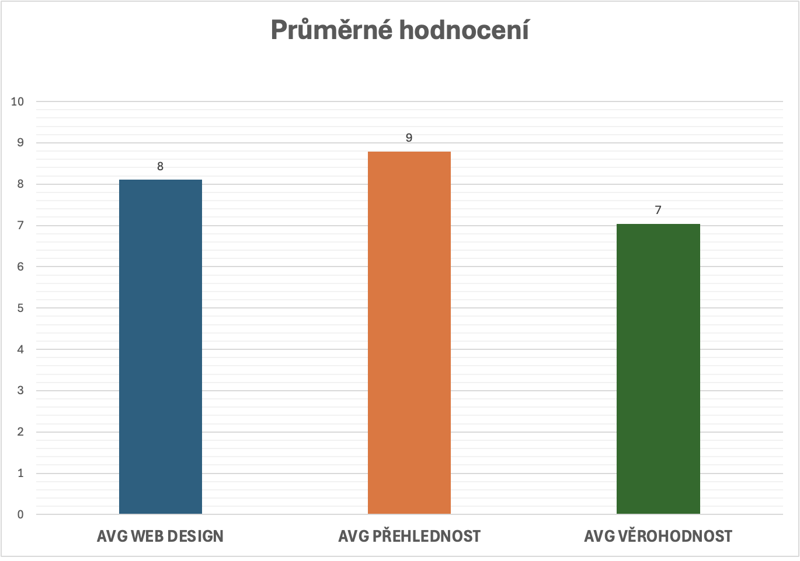
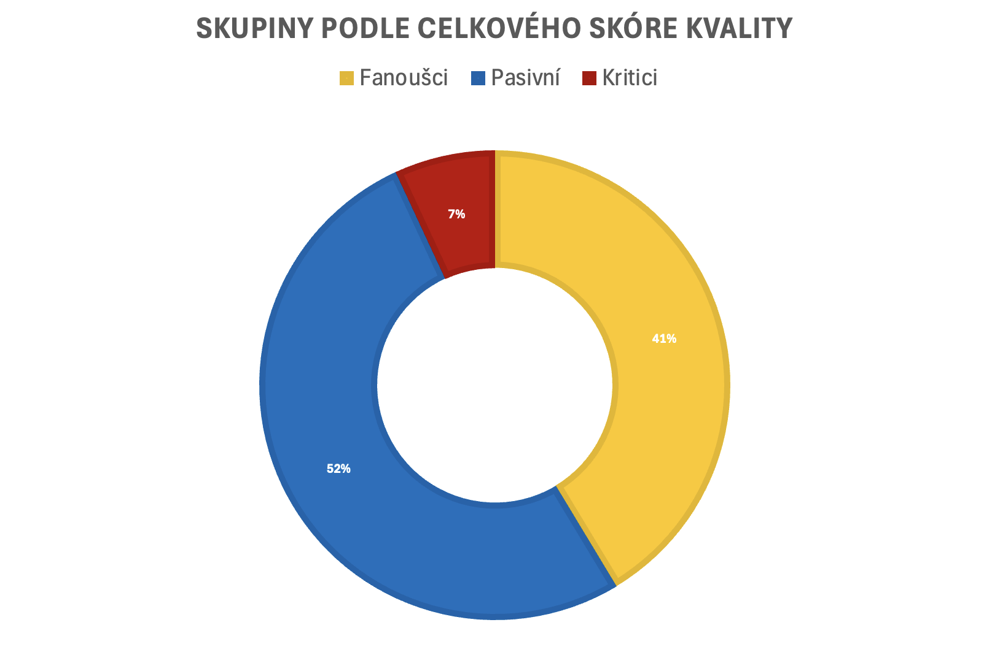
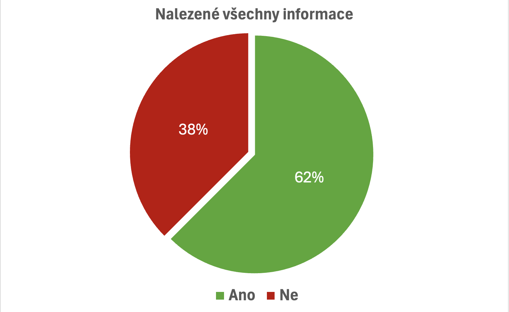

# 📊 Analýza zpětné vazby uživatelů webu [t-shark.cz](https://t-shark.cz)

## 🧩 O projektu
Tento projekt vznikl jako součást interního zlepšování webové prezentace **t-shark.cz**, která slouží k prezentaci našich produktů a služeb.  
Cílem bylo **získat zpětnou vazbu od studentů**, analyzovat ji a na základě výsledků pomoci frontend týmu lépe pochopit potřeby uživatelů a identifikovat oblasti pro zlepšení.

## 🎯 Cíl projektu
- Zjistit, jak uživatelé hodnotí design, přehlednost a důvěryhodnost webu.  
- Získat kvalitativní zpětnou vazbu ve formě slovních komentářů.  
- Vytvořit přehlednou **analýzu dat** a **vizualizace**, které podpoří rozhodování frontend týmu.

## 🧠 Proces sběru dat
- Data byla sbírána **osobně** (dotazováním studentů na školách).  
- Každý respondent poskytl:
  - **3 číselná hodnocení** – design, přehlednost, důvěryhodnost (škála 1–10)  
  - **3 slovní odpovědi** – co se líbilo, celkový dojem, doporučení na vylepšení
- Sběr probíhal v **týmu 4 členů**, přičemž jsem působil jako **team leader frontend týmu** a zároveň jsem byl autorem myšlenky provést tuto analýzu.

## ⚙️ Zpracování dat
- Všechna nasbíraná data byla zapsána do **Excelu**.
  
  
  
- Po ukončení sběru jsem data:
  1. Vyčistil a sjednotil formát odpovědí  
  2. Spočítal průměrná hodnocení  
  3. Určil celkové skóre kvality jednotlivých respondentů  
  4. Rozdělil je do skupin:
     - 🟢 **Fanoušci** (25–30 bodů)  
     - 🟡 **Pasivní** (18–24 bodů)  
     - 🔴 **Kritici** (3–17 bodů)
  5. Vytvořil tři přehledné grafy:
     - 📈 Průměrné hodnocení (design / přehlednost / důvěryhodnost)  
     - ✅ Poměr respondentů, kteří našli všechny potřebné informace (Ano / Ne)  
     - 👥 Rozložení skupin podle celkového skóre kvality
       

## 📈 Klíčové Vizualizace a Výsledky

Níže jsou hlavní grafy, které jsme vytvořili v Excelu, aby rychle ukázaly, co si uživatelé myslí.

### 1. Průměrné Hodnocení Designu, Přehlednosti a Důvěryhodnosti

### 2. Rozdělení Uživatelů Podle Skupin (Kvalita Skóre)

### 3. Nalezení Informací

## ✅ Výstupy a přínosy
Výsledky analýzy umožnily frontend týmu:
- Zaměřit se na **zlepšení navigace a struktury webu**
- Optimalizovat **responsivní design**
- Přehodnotit **barevné schéma a přístupnost**
- Prioritizovat úpravy na základě skutečné uživatelské zpětné vazby

Díky analýze bylo možné lépe porozumět cílové skupině a učinit rozhodnutí založená na datech.

## 🧾 Použité nástroje
- **Microsoft Excel** – záznam a zpracování dat  
- **Google Sheets / Excel grafy** – tvorba vizualizací  
- **GitHub** – správa projektu a sdílení výsledků  

## 🚀 Závěr
Projekt **„Analýza zpětné vazby uživatelů webu t-shark.cz“** přinesl konkrétní a měřitelné poznatky o vnímání našeho webu studenty.  
Díky této analýze jsme mohli lépe pochopit potřeby cílové skupiny a nasměrovat budoucí úpravy designu a funkčnosti webu správným směrem.
